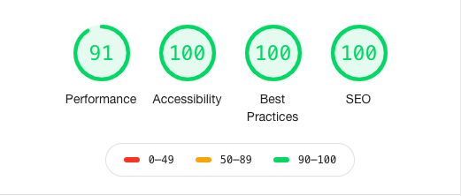

# Hackernews Clone 

Clone of the Hackernews app main page. The app is hosted on **Heroku**. Use the below URL for accessing the app:

[https://madhuni-hackernews.herokuapp.com/](https://madhuni-hackernews.herokuapp.com/)

## Designs

For the application, I didn't copy the original mockup instead I have tried to create a whole new experience and changed the layout of the page completely.

My goal was to keep the app simple but at the same time give a feel of modern web app while it's responsive across different devices.

The new UI design is made using **Figma** and the spec can be found [here](https://www.figma.com/file/X2nLZkmPkNo5QnoVW4zsiS/Hackernews-Clone?node-id=0%3A1). Link for the **Prototype** can be found [here](https://www.figma.com/proto/X2nLZkmPkNo5QnoVW4zsiS/Hackernews-Clone?node-id=1%3A14&viewport=658%2C465%2C0.20630435645580292&scaling=min-zoom).

## Feature requests checklist

- [x] Ensure your UI is responsive and clean. (don’t focus to make the code complex; make it clean and working).

- [x] Hide functionality is correctly implemented.

- [x] Upvote is implemented. (add more upvotes don’t restrict on just one; The timeline chart should update real time as and when the upvote is clicked).

- [x] Pagination (previous/back) is working and that URL should be bookmark able.

- [ ] Ensure SSR (server side rendering) is in place. Avoid using Nextjs and Gatsby and try to customize it. It will put your candidature above others.

- [x] CI/CD setup is done.

- [x] Ensure Page 2 functionality does not break while refreshing it.

- [x] App state is maintained using Redux.

- [x] Component is divided properly and try using Atomic Design pattern.

- [ ] Write test cases for network calls.

- [x] Incorporate ESlint check.

- [ ] Incorporate Docker file.

- [x] App is deployed on Cloud platform.

- [x] Incorporate build pipeline.

- [x] Follow best coding practices.

- [x] Check on the performance in Lighthouse.

- [x] Once u hide news and refresh it, the hidden news should not appear again.

- [x] The UI should shrink when you minimize the window.

- [x] Use HTML semantic markup.

## Timeline Chart

Since I have implemented a new design, Timeline chart will not be visibile directly on the page (not a good UX). For solving that problem I have added a button `Show Treds` on top of each page which will show the timeline chart.

The timeline chart is still dynamic and if you upvote a news or hide a news, those changes will reflact in the chart when user will reopen that.

## Lighthouse results

## Additional Notes

In-app navigation b/w different pages is working fine. Use `Previous` and `Next` options to navigate b/w pages.

Back/Forward options on browsers are not supported and have some bug. I am aware of this and will fix that later on.
